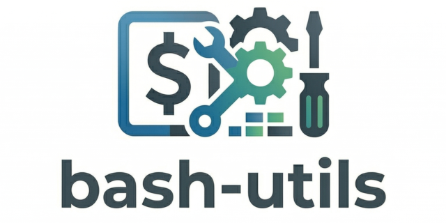

# Bash Utilities

This repository contains a collection of Bash utilities and scripts designed to simplify common tasks and enhance productivity when working with *nix systems, primarily focused on Linux.

## Other Tools

You may also be interested in the following related projects:

- [Bash Logger](https://github.com/GingerGraham/bash-logger): A flexible, reusable logging module for Bash scripts that provides standardized logging functionality with various configuration options.
- [Bash Input](https://github.com/GingerGraham/bash-input): A Bash library for handling user input with features like validation.
